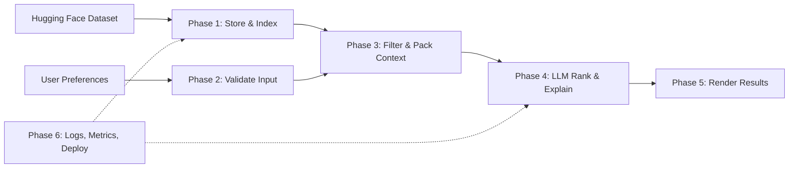

# Architecture: AI-Powered Restaurant Recommendation System

This folder holds the **phase-wise system architecture** for the Zomato-inspired recommendation service described in `problemstatement.md`. Each phase document is self-contained (goals, components, interfaces, data flows, risks, and deliverables) so teams can implement or review one slice at a time.

## Phases (in execution order)

| Phase | Focus | Document |
|-------|--------|----------|
| 0 | Foundations, constraints, and cross-cutting decisions | [phase-00-foundations.md](./phase-00-foundations.md) |
| 1 | Data ingestion and preprocessing (Hugging Face dataset) | [phase-01-data-ingestion.md](./phase-01-data-ingestion.md) |
| 2 | User input model, validation, and intake surface (API/UI) | [phase-02-user-input.md](./phase-02-user-input.md) |
| 3 | Integration layer: filter, normalize, prompt assembly | [phase-03-integration-layer.md](./phase-03-integration-layer.md) |
| 4 | Recommendation engine: LLM ranking, explanations, optional summary | [phase-04-recommendation-engine.md](./phase-04-recommendation-engine.md) |
| 5 | Output display and user-facing presentation | [phase-05-output-display.md](./phase-05-output-display.md) |
| 6 | Quality, observability, security, and deployment | [phase-06-operations.md](./phase-06-operations.md) |

## End-to-end flow (reference)

## LLM provider

Phases 3 and 4 use **Groq LLM** exclusively, configured via environment variables (see `.env` and the `LLM_API_KEY` value).

## Dataset source

- [ManikaSaini/zomato-restaurant-recommendation](https://huggingface.co/datasets/ManikaSaini/zomato-restaurant-recommendation)
