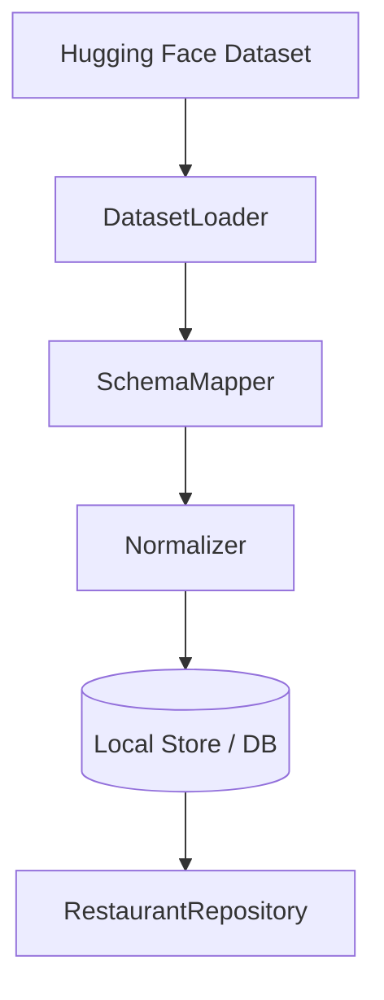

# Phase 1: Data Ingestion and Preprocessing

## Purpose

Load the real-world Zomato-style dataset from Hugging Face ([ManikaSaini/zomato-restaurant-recommendation](https://huggingface.co/datasets/ManikaSaini/zomato-restaurant-recommendation)), extract the fields needed for filtering and display, normalize them for deterministic matching, and persist or index them for fast retrieval.

## Scope

- Dataset download / streaming via `datasets` (Hugging Face) or cached export.
- Field mapping from raw columns → internal `Restaurant` model.
- Cleaning: handle nulls, unify cuisine strings, parse cost and rating consistently.
- Optional: build simple indexes (by city, cuisine tokens, cost bucket) for Phase 3.

## Components

| Component | Responsibility |
|-----------|----------------|
| **DatasetLoader** | Fetches dataset split(s); supports offline cache path for repeat runs. |
| **SchemaMapper** | Maps HF column names to internal fields; documents any renames. |
| **Normalizer** | Lowercases location tokens, splits multi-cuisine strings, maps cost to `low|medium|high` if raw is numeric or categorical. |
| **Repository** | `list_restaurants()`, optionally `get_by_id()`; abstraction over DataFrame/SQL/Parquet. |
| **IngestionJob** (optional) | CLI or scheduled task to refresh data and bump `dataset_version`. |

## Target fields (align with problem statement)

Minimum set to support workflow:

- Restaurant name  
- Location (city / area as provided by dataset)  
- Cuisine(s)  
- Cost (for budget matching)  
- Rating  
- Any usable extras in the dataset (e.g., establishment type, votes) → map to optional tags for “family-friendly” style preferences if present; otherwise leave for LLM to interpret only from name + context (document limitation).

## Data flow



## Design details

1. **Stable IDs**: Assign a stable `restaurant_id` (hash of key fields or HF index) so Phase 4 can validate LLM picks against allowed IDs.
2. **Budget alignment**: Define explicit rules, e.g. map dataset cost to three bands with documented thresholds; if the dataset uses “cost for two,” document the mapping.
3. **Location matching**: Prefer exact city match first; optional fuzzy match (e.g., Delhi vs New Delhi) via alias table or normalization rules.
4. **Cuisine matching**: Tokenize multi-label cuisines; match if any user-requested cuisine intersects restaurant labels.
5. **Rating filter**: Apply `rating >= min_rating` after parsing; define behavior for missing ratings (exclude or default).

## Interfaces (downstream contract)

```text
RestaurantRepository:
  - load_all() -> Iterable[Restaurant]
  - filter(criteria: FilterCriteria) -> list[Restaurant]   # may move to Phase 3 service
```

Keep repository **data-centric**; business rules that combine user preferences can live in Phase 3 while ingestion ensures fields are comparable.

## Risks and mitigations

| Risk | Mitigation |
|------|------------|
| Column names differ from docs | Inspect `dataset.features` at ingest time; fail fast with clear error. |
| Very large dataset | Stream batches; pre-aggregate by city for UI browse if needed. |
| Dirty ratings/costs | Validation report during ingest (counts of nulls, outliers). |

## Deliverables checklist

- [ ] Ingestion script or module with cached raw + normalized outputs
- [ ] Documented column mapping (`docs` inline in code or README in `architecture/`)
- [ ] Sample query proving filter-by-city and filter-by-min-rating works on normalized data

## Dependencies

- **Phase 0**: `Restaurant` schema, config paths, logging.

## Consumers

- **Phase 3**: Integration layer uses repository and filter criteria.
- **Phase 5**: Display uses normalized display fields (name, cuisine, rating, cost).
