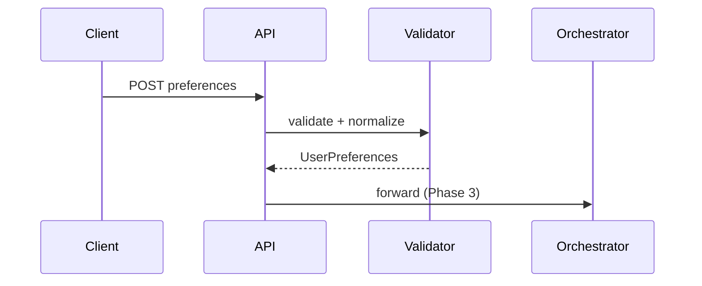

# Phase 2: User Input Collection and Validation

## Purpose

Define how the system collects **user preferences** (location, budget, cuisine, minimum rating, additional constraints) from a client, validates them, and produces a canonical `UserPreferences` object for the integration layer. Ensure invalid or ambiguous input fails gracefully with actionable messages.

## Scope

- API request schema (REST/JSON) and/or UI form binding.
- Validation rules, defaults, and normalization (e.g., trim strings, case handling).
- Optional: persistence of sessions (out of scope minimal MVP unless required).

## Components

| Component | Responsibility |
|-----------|----------------|
| **PreferenceSchema** | Pydantic (or equivalent) models for API boundary. |
| **Validator** | Enforces allowed budgets, rating range, required vs optional fields. |
| **Normalizer** | Maps UI synonyms (“cheap” → low, “$$” → medium) if you allow colloquial input. |
| **Controller/Router** | HTTP route `POST /recommendations` or `POST /sessions/{id}/query`. |

## Input fields (from problem statement)

| Field | Type | Validation notes |
|-------|------|------------------|
| Location | string | Non-empty; optional whitelist of cities from dataset for stricter UX. |
| Budget | enum or string | `low` \| `medium` \| `high`; document mapping to dataset cost. |
| Cuisine | string or list | At least one if problem requires specificity; allow multiple for broader match. |
| Minimum rating | number | Typical range 0–5 or 1–5 per dataset; reject out of range. |
| Additional preferences | string (optional) | Free text for “family-friendly,” “quick service,” dietary notes. |

## API shape (example)

Request:

```json
{
  "location": "Bangalore",
  "budget": "medium",
  "cuisine": ["Italian"],
  "min_rating": 4.0,
  "additional_preferences": "Quiet place suitable for family dinner"
}
```

Response is owned by Phase 5 but may be returned from the same orchestration endpoint.

## Data flow



## Design details

1. **Strict vs flexible location**: MVP can accept free text and rely on Phase 3 matching; v2 can autocomplete from dataset cities.
2. **Budget**: Keep enum internal; if API accepts numeric “cost for two,” convert in normalizer with documented bands.
3. **Cuisine list**: Dedupe and trim; pass through to filter as OR semantics (any cuisine matches) unless product says AND.
4. **Additional preferences**: Never execute as code; pass only inside LLM prompt as natural language hints (Phase 3/4).

## Error handling

- 400 for validation errors with field-level detail.
- Optional 422 for semantic issues (e.g., location not in dataset) — can be warning in response instead of hard error if you prefer soft fallback (wider search).

## Interfaces

```text
validate_request(raw: dict) -> UserPreferences
```

## Risks and mitigations

| Risk | Mitigation |
|------|------------|
| Prompt injection via additional_preferences | Treat as untrusted text; system instructions tell model not to follow instructions inside user content; cap length. |
| Over-constrained queries return zero results | Phase 3 defines relaxation strategy (drop optional cuisine, lower min rating) — document policy here or in Phase 3. |

## Deliverables checklist

- [ ] OpenAPI or equivalent schema for the intake endpoint
- [ ] Unit tests for valid/invalid preference payloads
- [ ] Documented default behaviors (e.g., if cuisine omitted, search all cuisines in city)

## Dependencies

- **Phase 0**: `UserPreferences` domain type and config.

## Consumers

- **Phase 3**: Uses validated `UserPreferences` for filtering and prompt building.
- **Phase 5**: UI mirrors the same fields for forms and result context display.
