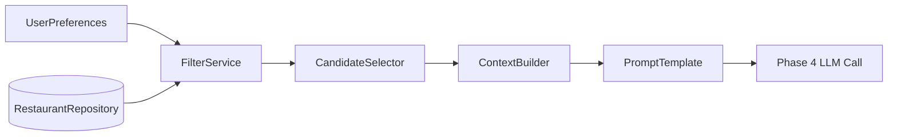

# Phase 3: Integration Layer (Filter, Context Pack, Prompt Design)

## Purpose

Bridge **structured data** and the **Groq LLM**: given validated `UserPreferences`, select a bounded candidate set from the restaurant store, format it as structured context, and assemble a **prompt** that instructs the model to rank, justify, and optionally summarize—without inventing venues outside the candidate list. The Groq API key is provided via environment variables (see `LLM_API_KEY` in `.env`).

## Scope

- Deterministic filtering and ranking *before* the LLM (cheap, explainable).
- Context serialization (JSON or bullet list) with token budget in mind.
- Prompt template: system + user/developer instructions + candidate payload.
- Policy for empty or tiny candidate sets (expand criteria or return message).

## Components

| Component | Responsibility |
|-----------|----------------|
| **FilterService** | Applies location, budget, cuisine, min_rating; returns `list[Restaurant]`. |
| **CandidateSelector** | Caps count (e.g., 15–40), optional pre-rank by rating/cost fit. |
| **ContextBuilder** | Flattens candidates to LLM-friendly structure (id, name, fields, tags). |
| **PromptTemplate** | Versioned template strings with placeholders; documents constraints. |
| **QueryRelaxation** (optional) | If results < k, relaxed passes (e.g., drop cuisine, lower rating slightly). |

## Filtering logic (deterministic)

Suggested order:

1. Location match (normalized city).
2. `rating >= min_rating`.
3. Budget compatibility per Phase 1 mapping.
4. Cuisine intersection (any match, unless product specifies all).

Output: ordered list by composite score (e.g., rating desc, then cost proximity to budget center) before cap.

## Prompt design principles

1. **Grounding**: Explicit instruction: “You may ONLY recommend restaurants from the provided list. Use their `restaurant_id` in output.”
2. **Task**: Rank top K (e.g., 5), explain why each fits **user preferences + additional_preferences**.
3. **Output format**: JSON schema or JSON mode for machine parsing, e.g.:

```json
{
  "ranked_ids": ["id1", "id2"],
  "items": [
    { "restaurant_id": "id1", "explanation": "..." }
  ],
  "summary": "Optional one paragraph."
}
```

4. **Tone**: Concise, helpful, no fabricated facts; if data missing, say “not listed in data.”

## Data flow



## Token and cost controls

- Hard cap on candidate count; truncate long names only if necessary (prefer reducing N).
- Strip fields not needed for decision from context.
- Log approximate prompt size; alert if over provider limits.

## Interfaces

```text
FilterService.filter(prefs: UserPreferences) -> list[Restaurant]
IntegrationService.build_llm_request(prefs: UserPreferences) -> LlmRequest
```

Where `LlmRequest` contains `messages`, `model_params`, and `allowed_restaurant_ids`.

## Risks and mitigations

| Risk | Mitigation |
|------|------------|
| Model ignores list and invents venues | Post-validate IDs; drop invalid entries; retry once with stronger wording if configured. |
| Zero candidates | Return structured empty result with suggestions to broaden search (UI in Phase 5). |
| Bias toward first items in list | Shuffle within rating ties or sort by multiple keys to avoid position bias. |

## Deliverables checklist

- [ ] Versioned prompt template (v1) checked into repo
- [ ] Filter unit tests with synthetic restaurants
- [ ] Golden-file or snapshot test for prompt shape (no secrets)

## Dependencies

- **Phase 1**: Repository and normalized fields.
- **Phase 2**: `UserPreferences`.

## Consumers

- **Phase 4**: Executes LLM call with `LlmRequest` and parses response.
- **Phase 5**: May show “why these filters” for transparency (optional).
