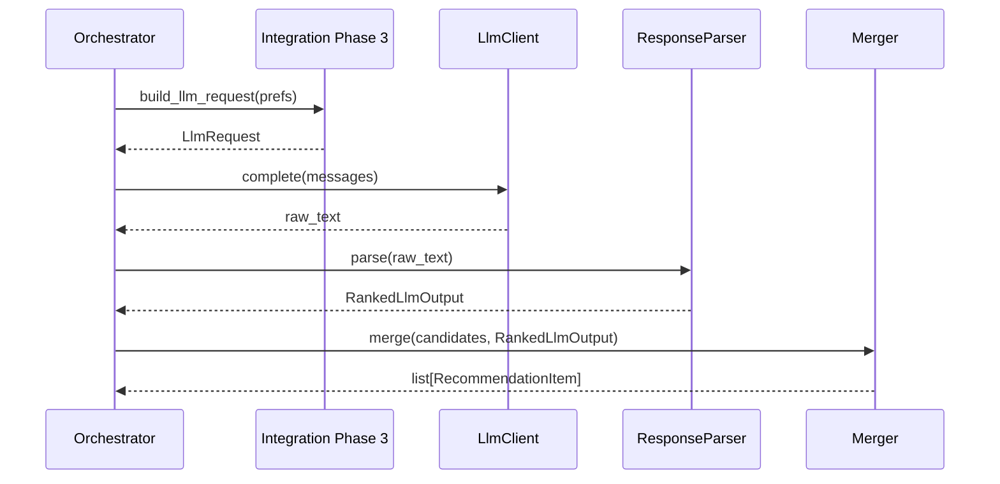

# Phase 4: Recommendation Engine (LLM)

## Purpose

Call the configured LLM with the assembled prompt, **parse structured output**, validate against the candidate set, and produce a ranked list of recommendations with **human-like explanations** and an optional **summary** of the tray of choices.

## Scope

- LLM client abstraction (provider swap, test double).
- Request parameters: model name, temperature (low for ranking tasks), max tokens, timeout.
- Response parsing and repair (handle markdown fences, minor JSON slips).
- Merge model output with canonical restaurant rows for display fields.

## Components

| Component | Responsibility |
|-----------|----------------|
| **LlmClient** | Single place for `complete(messages, **kwargs)`. |
| **RecommendationService** | Orchestrates: build request (from Phase 3) → call LLM → parse → validate. |
| **ResponseParser** | JSON extraction; schema validation against pydantic models. |
| **Merger** | Joins `restaurant_id` → full `Restaurant` + `explanation`. |
| **FallbackPolicy** | On failure, return heuristic top-N from candidates with static explanation template. |

## Execution flow



## Model behavior contract

- **Input**: User preferences (short), additional_preferences, structured candidate list.
- **Output**: Top K recommendations with explanations tied to explicit preference cues (budget, cuisine, rating, extra text).
- **Constraints**: No new restaurants; explanations must not claim amenities absent from supplied fields unless clearly framed as inference (“typically…”) — product choice; stricter apps forbid inference beyond data.

## Parsing and validation

1. Extract JSON from response (strip ``` fences if present).
2. Validate with schema: every `restaurant_id` ∈ `allowed_restaurant_ids`.
3. Preserve LLM order for ranking; de-duplicate IDs.
4. If fewer than K valid IDs, optionally backfill from deterministic order with a note “algorithmically added.”

## Quality levers

- **Temperature**: 0.2–0.4 for stable rankings.
- **Structured output**: Prefer provider JSON mode / response_format if available.
- **Second pass** (optional): Only if product needs richer copy—keep single pass for MVP.

## Interfaces

```text
RecommendationService.recommend(prefs: UserPreferences) -> RecommendationResponse
```

## Risks and mitigations

| Risk | Mitigation |
|------|------------|
| Provider outage | Timeout + fallback; surface message to user. |
| JSON parse errors | Retry once with “return only JSON” repair prompt; then fallback. |
| Cost spikes | Cap candidates; cache by preference hash (Phase 0). |

## Deliverables checklist

- [ ] `LlmClient` with timeout and typed errors
- [ ] Parser tests with fixture LLM outputs (good + malformed)
- [ ] End-to-end test with mocked LLM returning valid JSON

## Dependencies

- **Phase 3**: `LlmRequest`, candidates, prompt.
- **Phase 0**: Config for model and secrets.

## Consumers

- **Phase 5**: Renders `RecommendationResponse`.
- **Phase 6**: Metrics on latency, errors, token usage.

## Frontend note (later phase)

Frontend website/UI changes are **not** implemented in Phase 4. They will be added after the backend recommendation engine is stable, and the UI architecture will be updated accordingly in `docs/architecture/`.
