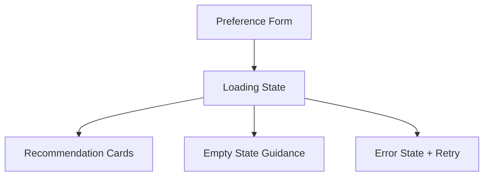

# Phase 5: Output Display and User Experience

## Purpose

Present **top recommendations** in a clear, user-friendly format: restaurant name, cuisine, rating, estimated cost, and **AI-generated explanation**, plus optional summary. Ensure layout works on web or API consumers (mobile clients, etc.).

## Scope

- Response DTO mapping from `RecommendationResponse` to API JSON and/or web UI components.
- UX for empty states, errors, and loading.
- Accessibility basics: readable contrast, semantic headings, keyboard focus if web.

## Required presentation fields (per problem statement)

| Field | Source |
|-------|--------|
| Restaurant name | From merged `Restaurant` record (ground truth). |
| Cuisine | From record (not LLM paraphrase for factual line). |
| Rating | From record; format to one decimal if needed. |
| Estimated cost | From record or mapped budget band label. |
| AI-generated explanation | From LLM output, paired by id. |

Optional: rank badge (#1, #2), “why this match” collapsible, summary blurb at top.

## Components

| Component | Responsibility |
|-----------|----------------|
| **ResponseMapper** | Maps internal model to stable public JSON schema. |
| **Web UI** (if applicable) | Card list, skeleton loaders, error banners. |
| **Copy layer** | Consistent labels (“Estimated cost for two,” etc.) per dataset reality. |

## API response example (public contract)

```json
{
  "summary": "Here are Italian options in Bangalore within a medium budget.",
  "recommendations": [
    {
      "rank": 1,
      "name": "...",
      "cuisine": ["Italian"],
      "rating": 4.3,
      "estimated_cost": "Medium (₹₹)",
      "explanation": "Matches your medium budget and exceeds your 4.0 rating bar..."
    }
  ],
  "meta": {
    "dataset_version": "2026-04-01",
    "candidates_considered": 24
  }
}
```

Keep `meta` optional for minimal clients.

## UI flow (web)



## Design details

1. **Trust**: Show which fields are from data vs AI copy (small caption or badge).
2. **Errors**: Distinguish validation errors (fix form) from server/LLM errors (retry).
3. **Empty results**: Suggest relaxing rating or cuisine with buttons if Phase 3 supports it.
4. **Internationalization**: If needed later, keep strings in resource files; MVP can be English-only.

## Risks and mitigations

| Risk | Mitigation |
|------|------------|
| Long explanations break layout | Character cap in UI with expand; or ask model for max words in Phase 3. |
| Stale data vs snappy UI | Show last ingest date in footer or meta. |

## Deliverables checklist

- [ ] Public JSON schema documented and versioned lightly (v1)
- [ ] UI mock or implemented cards listing all required fields
- [ ] Empty and error states copy

## Dependencies

- **Phase 4**: `RecommendationResponse`.
- **Phase 2**: Same labels as input form for coherence.

## Consumers

- End users and any third-party API clients.
