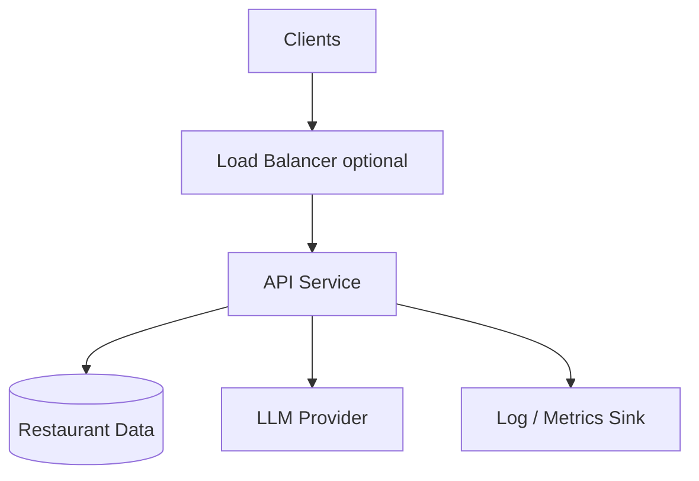

# Phase 6: Quality, Observability, Security, and Deployment

## Purpose

Make the recommendation service **reliable and shippable**: test strategy, monitoring, safe handling of keys and user text, and a simple deployment story. This phase closes the loop on the problem statement workflow in a production-minded way without blocking an MVP.

## Scope

- Automated tests (unit, integration, optional eval harness).
- Logging and metrics; tracing optional.
- Secret management and configuration for deployed environments.
- Deployment topology (local, container, cloud)—choose one path and document.

## Testing strategy

| Layer | Focus |
|-------|--------|
| Unit | Normalizers, filters, parsers, validators (Phases 1–4). |
| Integration | Ingest sample slice → filter → mock LLM → API response schema. |
| Manual / eval | Spot-check prompts and outputs; small set of preference scenarios. |

Optional **LLM evaluation**: pairwise comparison of rankings vs a simple scoring baseline—document as future work if not in MVP.

## Observability

- **Logs**: Correlation id per request; log filter counts, LLM latency, parse success/failure (no API keys).
- **Metrics**: Request count, error rate, p95 latency, LLM token usage if exposed.
- **Alerts**: Error rate threshold, LLM quota exhaustion.

## Security and abuse

- Rate limit public endpoints (per IP or API key).
- Cap `additional_preferences` length; strip control characters.
- Dependency scanning in CI if available.
- Never log full prompts containing secrets; redact API keys.

## Deployment (recommended path)

1. **Container**: Dockerfile for API + optional worker for ingestion.
2. **Config**: Environment variables for provider, model, dataset path/version.
3. **Data**: Bake small dev slice in image or mount volume; production loads from object storage or HF with cache.

## Risks and mitigations

| Risk | Mitigation |
|------|------------|
| Secret leak | CI uses masked vars; rotation playbook. |
| Cost runaway | Per-user limits; alerts on token spikes. |
| Dataset updates break app | `dataset_version` in responses; ingest pipeline with tests. |

## Deliverables checklist

- [ ] `docker compose` or Dockerfile for local parity
- [ ] Example `.env.example` without real keys
- [ ] Runbook: how to refresh data, rotate keys, and verify health

## Dependencies

- All prior phases.

## Consumers

- Operators, SRE/on-call, and future contributors.
